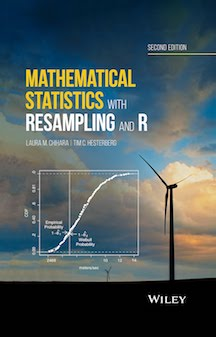

# resampledata

[](https://travis-ci.org/rudeboybert/resampledata)
[](http://cran.r-project.org/package=resampledata)

R package of data sets used in [Mathematical Statistics with Resampling in R](https://sites.google.com/site/chiharahesterberg/) (2011) by Laura Chihara and Tim Hesterberg.



## Installation

Coming Soon: Get the released version from CRAN:

```R
install.packages("resampledata")
```

Or the development version from GitHub:

```R
# If you haven't installed devtools yet, do so:
# install.packages("devtools")
devtools::install_github("rudeboybert/resampledata")
```

## Data Sets

To see a list of all data sets, type:

```R
data(package = "resampledata")
```

To load a particular data set, `FlightDelays` for example, type:

```R
data(FlightDelays)
```

Note the following data sets were not included due to sharing restrictions and 
can only be accessed on the [textbook's
webpage](https://sites.google.com/site/chiharahesterberg/): `Bangladesh`,
`GSS2002`, `GSS2006`, and `Volleyball2009`.
